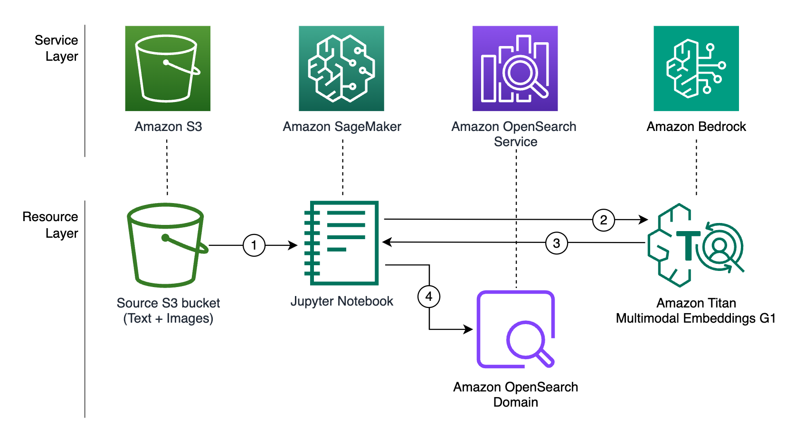
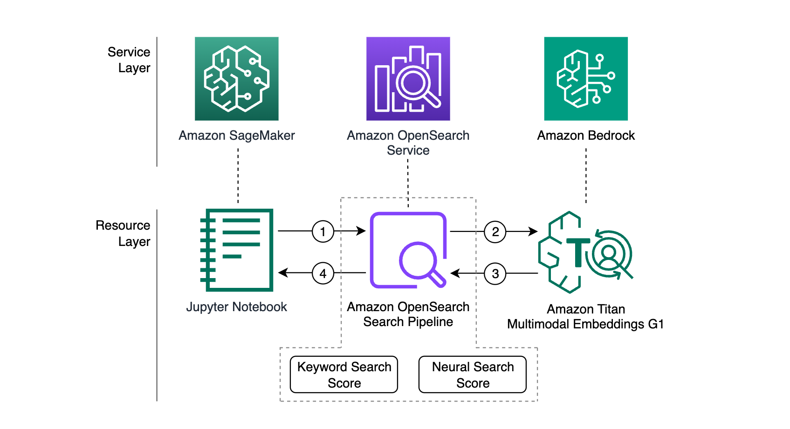

# Combine keyword and semantic search for text and images using Amazon Bedrock and Amazon OpenSearch Service

Customers today expect to find products quickly and efficiently through intuitive search functionality. A seamless search journey not only enhances the overall user experience, but also directly impacts key business metrics such as conversion rates, average order value, and customer loyalty. Hybrid search combines the strengths of keyword search and semantic search, enabling retailers to deliver more accurate and relevant results to their customers. 

In this sample, we show how to use [OpenSearch hybrid search](https://opensearch.org/docs/latest/search-plugins/hybrid-search/) to combine keyword and semantic search, enabling users to submit both text and images as queries to retrieve relevant results from a sample retail image dataset. We also show how to connect [Amazon OpenSearch Service](https://aws.amazon.com/opensearch-service/) to the [Amazon Titan Multimodal Embeddings G1](https://docs.aws.amazon.com/bedrock/latest/userguide/titan-multiemb-models.html) model, enabling you to use Amazon Bedrock foundation models (FMs) to power semantic search. With Amazon Titan Multimodal Embeddings G1, you can generate embeddings for your content and store them in OpenSearch as a vector.

# Solution Overview

This solution has two main workflows: (1) *Data ingestion workflow* generates vector embedding for text, images, and metadata using Amazon Bedrock and Amazon Titan Multimodal Embeddings G1 model. Then, it stores vector embedding, text, and metadata in an Amazon OpenSearch Service domain. (2) *Query workflow*, a search pipeline in OpenSearch is used to convert the query input to embeddings using the embeddings model registered with OpenSearch. Then, within the OpenSearch Search Pipeline, results of semantic search and keyword search are combined to provide relevant search results to users.

This solution is accompanied by a Jupyter notebook available via GitHub and the respective AWS CloudFormation template to create the Amazon OpenSearch Service domain, AWS IAM User, and AWS IAM Roles required to run this notebook. 

## Data ingestion workflow 

In this workflow, we use a  JupyterLab notebook to (1) read text, images, and metadata from an Amazon S3 bucket, encode images in Base64 format, (2 and 3) generate encoded images and metadata embeddings, and (4) load metadata and embedding to an Amazon OpenSearch Service domain. 

This workflow generates images and metadata embeddings before loading them to the database, storing only vectors representing the images and respective metadata in OpenSearch and saving storage space.

1.	Read text, images, and metadata from an Amazon S3 bucket, and encode images in Base64 format.
2.	Send the text, images, and metadata to Amazon Bedrock using its API to generate embeddings using the Amazon Titan Multimodal Embeddings G1 model.
3.	The Amazon Bedrock API replies with embeddings to the Jupyter notebook.
4.	Store both the embeddings and metadata in an OpenSearch Service domain.

## Query workflow

In this workflow, we use [Amazon OpenSearch search pipelines](https://opensearch.org/docs/latest/search-plugins/search-pipelines/index/), a powerful feature that allows you to customize and enhance the search process by applying a sequence of processors or transformations to the data before it is returned as search results. These processors can manipulate and enrich the documents, filter the results, or even perform complex data processing operations. With Search Pipeline, you can define reusable pipelines that encapsulate these transformations making it easier to apply them consistently across different searches.

The workflow consists of the following steps:

1.	The client submits a query input containing text, a Base64 encoded image, or both to OpenSearch Service. Text submitted is used for both semantic and keyword search, and the image is used for semantic search.
2.	The OpenSearch search pipeline performs the keyword search using textual inputs and a neural search using vector embeddings generated by Amazon Bedrock using Titan Multimodal Embeddings G1 model.
3.	The [normalization processor](https://opensearch.org/docs/latest/search-plugins/search-pipelines/normalization-processor/) within the pipeline scales search results using techniques like `min_max` and combines keyword and semantic scores using `arithmetic_mean`.
4.	Ranked search results are returned to the client.

# Clean up
After you complete this walkthrough, clean up all the resources you created as part of this sample. This is an important step to make sure you don’t incur any unexpected charges. If you used an existing OpenSearch Service domain, in the Cleanup section of the notebook, we provide suggested cleanup actions, including delete the index, undeploy the model, delete the model, delete the model group, and delete the Amazon Bedrock connector. If you used the provided CloudFormation template to create an OpenSearch Service domain specifically for this exercise, you can delete the stack following the guide [Delete a stack from the CloudFormation console](https://docs.aws.amazon.com/AWSCloudFormation/latest/UserGuide/cfn-console-delete-stack.html).

## Security

See [CONTRIBUTING](CONTRIBUTING.md#security-issue-notifications) for more information.

## License

This library is licensed under the MIT-0 License. See the LICENSE file.